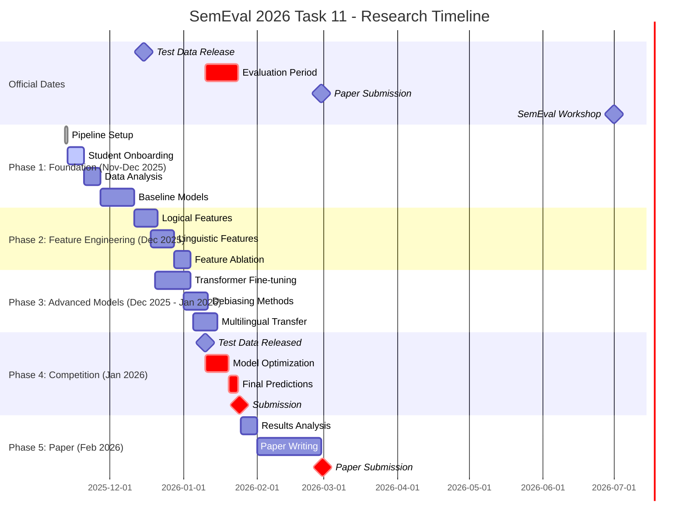

# 🔬 Research Direction - Task 11

## Primary Research Question

**Can we build models that assess formal validity of syllogisms independent of their content/plausibility?**

### Sub-Questions
1. What features best distinguish formal validity from content plausibility?
2. How can we reduce content effect bias in language models?
3. Can models trained on English generalize to other languages?
4. What role do irrelevant premises play in reasoning robustness?

---

## The Content Effect Problem

### What is Content Effect?

**Content Effect:** The tendency of models to confuse formal validity with plausibility.

**Example:**
```
Valid + Plausible (Easy):
"All dogs are mammals. All mammals breathe. → All dogs breathe."
✅ Models get this right (both valid AND plausible)

Valid + Implausible (Hard):
"All cats are reptiles. All reptiles are cold-blooded. → All cats are cold-blooded."
❌ Models often get this wrong (valid but implausible)
```

**Impact:** Models rely on world knowledge instead of logical structure.

---

## Research Hypotheses

### H1: Linguistic Features Can Reduce Content Effect
- **Hypothesis:** Extracting logical structure (quantifiers, connectives) helps models focus on form over content
- **Rationale:** Explicit logical features make formal structure more salient
- **Test:** Compare models with/without logical features on content effect metric
- **Expected Outcome:** 20-30% reduction in content effect

### H2: Contrastive Learning Reduces Bias
- **Hypothesis:** Training on plausible/implausible pairs with same validity reduces content bias
- **Rationale:** Forces model to learn validity independent of plausibility
- **Test:** Contrastive loss on (plausible, implausible) pairs with same validity label
- **Expected Outcome:** 30-40% reduction in content effect

### H3: Chain-of-Thought Improves Reasoning
- **Hypothesis:** Prompting models to explain reasoning step-by-step improves validity prediction
- **Rationale:** Explicit reasoning reduces reliance on shortcuts/biases
- **Test:** Compare standard prompts vs chain-of-thought prompts
- **Expected Outcome:** +10-15% accuracy, -15-20% content effect

### H4: Multilingual Transfer is Possible
- **Hypothesis:** Models trained on English can zero-shot transfer to other languages
- **Rationale:** Logical structure is language-independent
- **Test:** Train on English, evaluate on 12 languages
- **Expected Outcome:** 70-80% of English performance on related languages

### H5: Premise Selection Improves Robustness
- **Hypothesis:** Joint training on validity + premise selection improves both tasks
- **Rationale:** Identifying relevant premises forces attention to logical structure
- **Test:** Multi-task learning vs separate models
- **Expected Outcome:** +5-10% on both validity and premise selection

---

## Research Roadmap



---

## Experimental Plan

### Experiment 1: Baseline Comparison
- **Goal:** Establish baseline performance
- **Method:**
  1. Logistic Regression on TF-IDF features
  2. Random Forest on linguistic features
  3. Fine-tuned BERT
- **Metrics:** Accuracy, Content Effect
- **Expected Outcome:** BERT achieves 70-75% accuracy but high content effect

### Experiment 2: Logical Feature Engineering
- **Goal:** Test if explicit logical features reduce content effect
- **Method:**
  1. Extract quantifiers (all, some, no, not all)
  2. Identify logical connectives
  3. Parse syllogistic structure (premise 1, premise 2, conclusion)
  4. Train classifier on logical features only
- **Expected Outcome:** Lower accuracy (60-65%) but much lower content effect

### Experiment 3: Contrastive Learning
- **Goal:** Reduce content effect through contrastive training
- **Method:**
  1. Create pairs: (plausible, implausible) with same validity
  2. Contrastive loss: pull same-validity pairs together
  3. Fine-tune transformer with contrastive objective
- **Expected Outcome:** 75-80% accuracy with 30-40% lower content effect

### Experiment 4: Chain-of-Thought Prompting
- **Goal:** Improve reasoning through explicit steps
- **Method:**
  1. Standard prompt: "Is this syllogism valid? Yes/No"
  2. CoT prompt: "Let's think step by step: 1) What are the premises? 2) What is the conclusion? 3) Does the conclusion follow? 4) Is it valid?"
  3. Compare GPT-4, Llama-2, Mistral
- **Expected Outcome:** +10-15% accuracy, better explanations

### Experiment 5: Multilingual Zero-Shot Transfer
- **Goal:** Test cross-lingual generalization
- **Method:**
  1. Train mBERT/XLM-R on English data only
  2. Evaluate on all 12 languages
  3. Analyze performance by language family
- **Expected Outcome:** 
  - Related languages (German, French): 70-80% of English performance
  - Distant languages (Chinese, Telugu): 50-60% of English performance

### Experiment 6: Multi-Task Learning (Subtask 2/4)
- **Goal:** Joint validity prediction + premise selection
- **Method:**
  1. Shared encoder for both tasks
  2. Task-specific heads
  3. Weighted multi-task loss
- **Expected Outcome:** +5-10% on both tasks vs separate models

---

## Debiasing Strategies

### Strategy 1: Data Augmentation
- Create synthetic implausible syllogisms
- Swap entities to change plausibility while preserving validity
- Balance plausible/implausible in training

### Strategy 2: Adversarial Training
- Train adversary to predict plausibility
- Train main model to fool adversary while predicting validity
- Forces model to ignore plausibility cues

### Strategy 3: Causal Intervention
- Intervene on content words during inference
- Replace entities with neutral placeholders
- Predict validity on intervened text

### Strategy 4: Ensemble Methods
- Combine logical feature model (low bias) with transformer (high accuracy)
- Weighted ensemble based on content effect
- Adaptive weighting per instance

---

## Performance Targets

| Approach | Accuracy | Content Effect | Ranking Score |
|----------|----------|----------------|---------------|
| **Baseline (TF-IDF + LR)** | 60% | 0.25 | 2.4 |
| **+ Logical Features** | 65% | 0.15 | 4.3 |
| **Fine-tuned BERT** | 75% | 0.30 | 2.5 |
| **+ Contrastive Learning** | 78% | 0.18 | 4.3 |
| **+ Chain-of-Thought** | 82% | 0.15 | 5.5 |
| **Ensemble (Target)** | 85% | 0.12 | **7.1** 🎯 |

**Ranking Score = Accuracy / Content Effect** (higher is better)

---

## Success Criteria

**Minimum Viable:**
- ✅ 70%+ accuracy on Subtask 1
- ✅ Content effect < 0.20
- ✅ Working pipeline for all subtasks

**Target:**
- 🎯 80%+ accuracy on Subtask 1
- 🎯 Content effect < 0.15
- 🎯 Ranking score > 5.0
- 🎯 Published paper at SemEval 2026

**Stretch:**
- 🚀 85%+ accuracy
- 🚀 Content effect < 0.10
- 🚀 Top 3 in competition
- 🚀 Novel debiasing method

---

## Key Insights to Investigate

1. **What makes a syllogism hard?**
   - Implausible content?
   - Complex logical structure?
   - Negations and quantifiers?

2. **How does content effect vary by language?**
   - Do some languages show stronger bias?
   - Role of language-specific world knowledge?

3. **Can we explain model predictions?**
   - Attention visualization
   - Feature importance
   - Counterfactual analysis

4. **What's the role of model size?**
   - Small models (BERT-base) vs large (GPT-4)
   - Does scale reduce content effect?

---

For implementation details, see [README.md](README.md)
